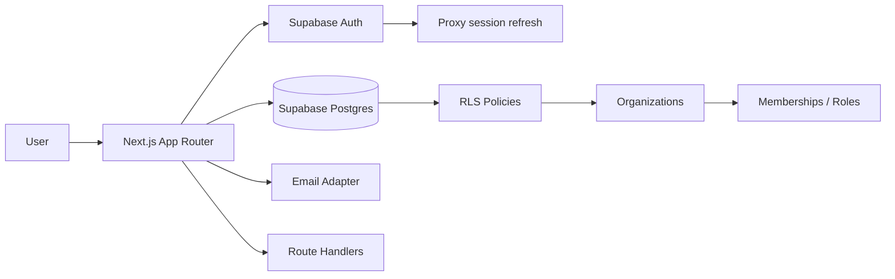

<div align="center">

# Africa SaaS Starter

### A production-minded SaaS foundation built with Next.js, TypeScript and Supabase.

**Auth · Multi-tenancy · Roles · Dashboard · Billing model · Email · RLS · Docker · CI**

[](https://nextjs.org/)
[](https://www.typescriptlang.org/)
[](https://supabase.com/)
[](./LICENSE)

</div>

---

## Why this exists

Many SaaS projects begin by rebuilding the same foundation: authentication, protected routes, organizations, roles, database policies, settings, billing concepts, transactional email and deployment plumbing.

**Africa SaaS Starter** packages those building blocks into a clean reference implementation. It is designed for developers building products in Africa and elsewhere, with particular attention to pragmatic deployment, intermittent infrastructure constraints, simple vendor boundaries and maintainable application architecture.

> This is an open-source starter, not a payment gateway, telecom integration or hosted SaaS product.

## Included

- Next.js 16 App Router + React 19
- TypeScript strict mode
- Tailwind CSS 4
- Supabase Auth using cookie-based SSR
- PostgreSQL schema + Row Level Security
- Organizations / workspaces
- Owner, admin and member roles
- Protected dashboard and admin routes
- SaaS plan model: Free / Pro / Business
- Transactional email adapter with console fallback
- Health and authenticated API routes
- Docker production image
- GitHub Actions CI
- Vitest example
- Security, architecture and deployment documentation

## Architecture



## Quick start

```bash
git clone https://github.com/popytech/africa-saas-starter.git
cd africa-saas-starter
npm install
cp .env.example .env.local
npm run dev
```

Create a Supabase project, add the values from the **Connect** dialog to `.env.local`, then run the SQL migration in `supabase/migrations/0001_init.sql`.

Open `http://localhost:3000`.

## Project structure

```text
src/
├── app/
│   ├── (auth)/          # login + signup
│   ├── admin/           # owner/admin protected surface
│   ├── api/             # route handlers
│   ├── auth/callback/   # auth callback
│   └── dashboard/       # authenticated product surface
└── lib/
    ├── auth.ts
    ├── billing.ts
    ├── email/
    └── supabase/
supabase/
└── migrations/
docs/
.github/workflows/
```

## Authentication and authorization

Authentication is handled by Supabase Auth. Authorization is deliberately separated into two layers:

1. **Application checks** for route-level UX and role gates.
2. **Postgres RLS** as the data-access security boundary.

Never rely only on a client-side role check for protected data.

## Multi-tenancy

Each customer can belong to one or more organizations. Memberships carry one of three roles:

- `owner`
- `admin`
- `member`

The migration provides helper functions and RLS policies so organization data is visible only to members.

## Billing

The starter includes a vendor-neutral plan model for product UI and entitlements. It intentionally does **not** ship with a live payment provider. Connect the billing provider appropriate to your market and compliance requirements.

## Email

`EMAIL_PROVIDER=console` works without external credentials and is ideal for local development. A Resend HTTP adapter is included and becomes active when `EMAIL_PROVIDER=resend` and `RESEND_API_KEY` are configured.

## Quality checks

```bash
npm run lint
npm run typecheck
npm test
npm run build
```

The same checks run in GitHub Actions.

## Deployment

The app can run on Vercel or any Node.js/Docker platform. See [`docs/DEPLOYMENT.md`](./docs/DEPLOYMENT.md).

## Security

Read [`SECURITY.md`](./SECURITY.md) before using the starter for production workloads. In particular:

- never expose the Supabase service-role key to the browser;
- keep RLS enabled on tenant data;
- verify server-side identity for protected operations;
- rotate credentials if they are ever committed.

## Roadmap

- [ ] Organization invitations
- [ ] Audit log UI
- [ ] Feature flags
- [ ] Pluggable billing providers
- [ ] Object storage example
- [ ] Background jobs example
- [ ] i18n starter (FR / EN)
- [ ] Africa-focused phone-number utilities

## Contributing

Contributions are welcome. Read [`CONTRIBUTING.md`](./CONTRIBUTING.md).

## License

MIT — use it, adapt it and build useful products with it.

---

<div align="center">

Built by **Popy Traoré** · Guinea 🇬🇳 → Africa 🌍

</div>
